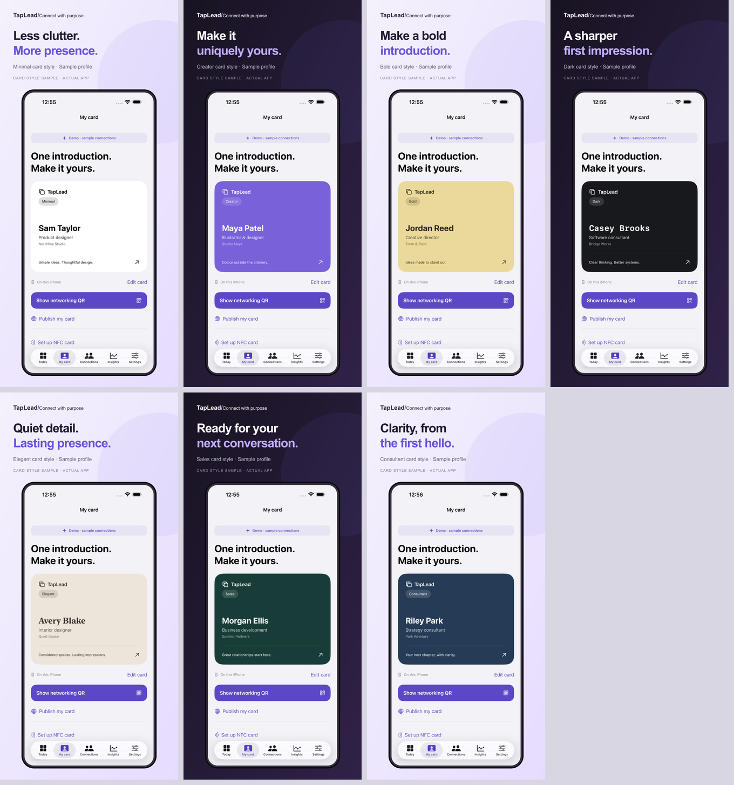

# Premium card screenshot samples

Seven original card-style samples are appended to the existing three App Store screenshots, giving ten images in each iPhone size. All app interfaces are genuine native simulator captures. Names, companies and profile text are fictional demo content; no third-party images or logos are used. “Premium” describes the visual presentation and does not imply a paid feature entitlement.

| Position | Style | 6.5-inch export | 6.9-inch export |
| --- | --- | --- | --- |
| 4 | Minimal | [PNG](assets/04-minimal-6.5.png) | [PNG](assets/04-minimal-6.9.png) |
| 5 | Creator | [PNG](assets/05-creator-6.5.png) | [PNG](assets/05-creator-6.9.png) |
| 6 | Bold | [PNG](assets/06-bold-6.5.png) | [PNG](assets/06-bold-6.9.png) |
| 7 | Dark | [PNG](assets/07-dark-6.5.png) | [PNG](assets/07-dark-6.9.png) |
| 8 | Elegant | [PNG](assets/08-elegant-6.5.png) | [PNG](assets/08-elegant-6.9.png) |
| 9 | Sales | [PNG](assets/09-sales-6.5.png) | [PNG](assets/09-sales-6.9.png) |
| 10 | Consultant | [PNG](assets/10-consultant-6.5.png) | [PNG](assets/10-consultant-6.9.png) |

The PNGs are opaque at 1242 × 2688 or 1320 × 2868 pixels. Corresponding editable SVG sources sit beside each PNG. Captured by the passing native premium sample test in [GitHub run 37203147150](https://github.com/lanray07/TapLead/actions/runs/37203147150); generated with [premium-store-assets.cjs](../scripts/premium-store-assets.cjs).
